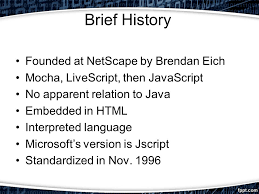
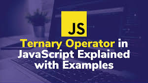
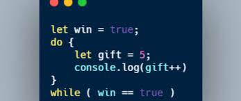
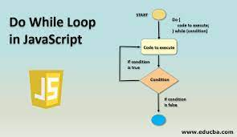
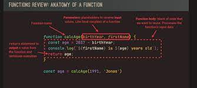

# Getting started with javascript
>JavaScript is a popular programming 
language that has a wide range of 
applications.

# JavaScript is also used in many other areas

# THE ROLE OF JAVASCRIPT IN WEB DEVELOPMENT

# A BRIEF HISTORY OF JAVASCRIPT 
>JavaScript was invented by Brendan Eich in 1995. It was developed for Netscape 2, and became the ECMA-262 standard in 1997. After Netscape handed JavaScript over to ECMA, the Mozilla foundation continued to develop JavaScript for the Firefox browser. Mozilla's latest version was 1.8.5.

# Brendan Eich
>Брендан Эйх или Айк — американский программист, создатель языка программирования JavaScript. С 1995 года работал в компании Netscape; участвовал в основании Mozilla, до 2014 года был главным инженером в Mozilla Corporation

# JAVASCRIPT RELEASES 
>The ECMAScript specification is a standardized specification of a scripting 
language developed by Brendan Eich of Netscape initially named Mocha, then 
LiveScript, and finally JavaScript.
Learn modern JavaScript from the beginning, but without forgetting the older 
parts!

# Run JavaScript
>Because of its wide range of 
applications, you can run 
JavaScript in several ways:
• Using console tab of web browsers
• Using Node.js
• By creating web pages

# OBJECTS AND PRIMITIVES
>1. Variable names must start with either a letter, an underscore _, or the dollar sign $.
2. Variable names cannot start with numbers. For example:
let 1simpleText = 'Javascript is really simple';
console.log(1simpleText);

# Operators IN JavaScript

# CONDITION If/else statement
>In JavaScript we have the following conditional statements: Use if to specify a block of code to be executed, if a specified condition is true. Use else to specify a block of code to be executed, if the same condition is false. Use else if to specify a new condition to test, if the first condition is false.

# CONDITION Ternary operator
>An alternative to the if/else statement, the ternary operator allows JavaScript developers to write concise conditional statements. It is written as “?:” and takes three operands; a logical condition, a value to return if true, and a value to return if false

# CONDITION Switch statment
>switch is a type of conditional statement that will evaluate an expression against multiple possible cases and execute one or more blocks of code based on matching cases. The switch statement is closely related to a conditional statement containing many else if blocks, and they can often be used interchangeably.

# LOOP for
>Loops can execute a block of code a number of times. JavaScript Loops. Loops are handy, if you want to run the same code over and over again, each time with...

# LOOP while
>The while statement creates a loop that
executes a specified statement as long as
the test condition evaluates to true. The 
condition is evaluated before executing the
statement.
The following while loop iterates as long as
n is less than three.
Note: Use the break statement to stop a 
loop before condition evaluates to true.

# LOOP Do/while
>The do...while statement creates a loop
that executes a specified statement until
the test condition evaluates to false. The 
condition is evaluated after executing
the statement, resulting in the specified
statement executing at least once.
In the following example, the do...while 
loop iterates at least once and reiterates 
until i is no longer less than 5.

# FUNCTIONS
> Functions are one of the fundamental building blocks in JavaScript. A function in JavaScript is similar to a procedure—a set of statements ...

# FUNCTION Declaration
>The function declaration defines a 
function with the specified
parameters. A function is declared 
using the function keyword.
The basic rules of naming a function 
are similar to naming a variable. It is 
better to write a descriptive name for 
your function. For example, if a 
function is used to add two numbers, 
you could name the function add or 
addNumbers.

# FUNCTION expression
>A function expression is very
similar to and has almost the
same syntax as a function
declaration.
The main difference between a 
function expression and a 
function declaration is
the function name, which can be
omitted in function expressions
to create anonymous and 
arrow functions.

# FUNCTION IIFE
>An IIFE (Immediately Invoked 
Function Expression) is a function 
that runs the moment it is invoked 
or called in the JavaScript event 
loop.
Having a function that behaves 
that way can be useful in certain 
situations. IIFEs prevent pollution 
of the global JS scope.

# FUNCTION REVIEW: ANATOMY of a function

# THANKS FOR WATCHING !!
